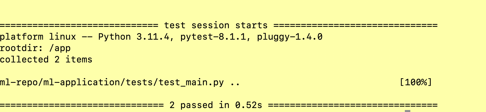
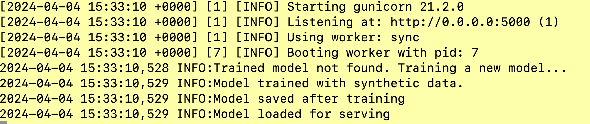

# ML Application

This is a basic machine learning application that serves predictions from a linear regression model via a Flask API.
This Flask-based application serves as a machine learning model hosting solution, utilizing Gunicorn as the HTTP Server to efficiently manage incoming requests and ensure robust performance under load. Designed with simplicity and scalability in mind, it offers a streamlined approach for deploying and interacting with predictive models in a production environment.

## Getting Started

### Prerequisites

1. Git - Version control system - to clone the repository
    https://git-scm.com/download/mac


2. Docker Desktop - Containerization service - to build and run the application
   https://docs.docker.com/desktop/install/mac-install/

Note: This code was built and tested on Macbook with Apple M1 chip.

## Setup and API Usage

Open a terminal window and follow the steps below to set up the project and run the application.

**1**. Create folder for the project

```mkdir ml-test && cd ml-test```


**2**. Clone the repository

```git clone git@github.com:venkatram-dev/ml-repo.git```


**3**. Change directory to the project root

```cd ml-repo/ml-application```


**4**. Build the Docker image

```docker build -t ml-application:v1 .```


**5**. tag the Docker image

```docker tag ml-application:v1 ml-application:latest```


**6**. run the tests

```docker run --rm -v $(pwd):/app -w /app ml-application:latest pytest```

Sample output screenshot below



**Note**: The tests are also automated using github actions. The CI/CD pipeline is defined in the .github/workflows/ folder
in the root of the repo. Please scroll down to the CI/CD pipeline section for more details.


**7**.Run the Docker container

```docker run -p 5000:5000 ml-application:latest```

Sample output screenshot below




**8**. Open a NEW TERMINAL window and test the API

```
curl -X POST http://localhost:5000/predict -H "Content-Type: application/json" -d "{\"feature_value\": 1.5}"
```


**9**.expected output

```
{"predicted_value":133.0924704590313}
```

Sample output screenshot below


**10.** PRESS **ctrl+c** on the previous terminal where the container is running to stop the container.


**BELOW ARE ADDTIONAL STEPS TO DEPLOY THE APPLICATION USING DOCKER SWARM**

**11**. docker swarm initialization

```docker swarm init```

If the above command fails, please run the below command.

```docker swarm init --advertise-addr 127.0.0.1 --listen-addr 127.0.0.1:2377```

**12**. deploy the application

```docker stack deploy -c deployment/docker-compose.yml ml-stack```

**13.** check the status of the application

```docker stack services ml-stack```

**14.** Open a NEW TERMINAL window and test the API

```
curl -X POST http://localhost:5000/predict -H "Content-Type: application/json" -d "{\"feature_value\": 1.5}"
```

**15.** expected output

```
{"predicted_value":133.0924704590313}
```

**16.** scale the application

```docker service scale ml-stack_ml-application=3```

**17.** Open a NEW TERMINAL window and test the API

```
curl -X POST http://localhost:5000/predict -H "Content-Type: application/json" -d "{\"feature_value\": 1.5}"
```

**18.** tear down the application

```docker stack rm ml-stack```

**--19.** leave the swarm (optional)

```docker swarm leave --force```

## CI/CD pipeline

The CI/CD pipeline is implemented using GitHub Actions. The pipeline is triggered on every pull request and push to the main branch. 
The pipeline consists of 2 different yaml files:

1. ci-cd.yml - to install requirements and to run the tests

2. docker-build.yml - to build the Docker image

For the latest ci/cd pipelines run using github actions, refer to the github link below:

https://github.com/venkatram-dev/ml-repo/actions/workflows/ci-cd.yml

https://github.com/venkatram-dev/ml-repo/actions/workflows/docker-build.yml


## Production Deployment

In production system, as part of the CI/CD pipeline, we can also push the Docker image to a container registry like Docker Hub or AWS ECR.

After that, we can deploy the application to a cloud provider like AWS, GCP using a container orchestration service like Docker swarm.
We can use terraform or similar infrastrucutre as code service to provision the infrastructure and deploy the application.

## Perform Online Inference
Once everything is set up, we can perform online inference by making POST requests to the API endpoint.

For example 

```
curl -X POST http://mydomain-service:5000/predict -H "Content-Type: application/json" -d "{\"feature_value\": 1.5}"
```

```
import requests

data = {'feature_value': 1.5}
response = requests.post('https://mydomain-service:5000/predict', json=data)

if response.status_code == 200:
    prediction = response.json().get('predicted_value')
    print('Prediction:', prediction)
else:
    print('Error:', response.text)
```

